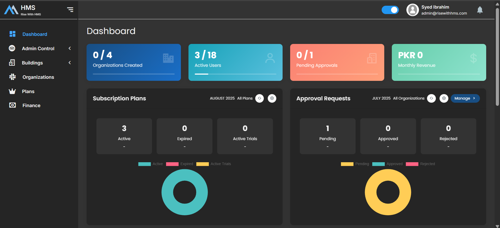
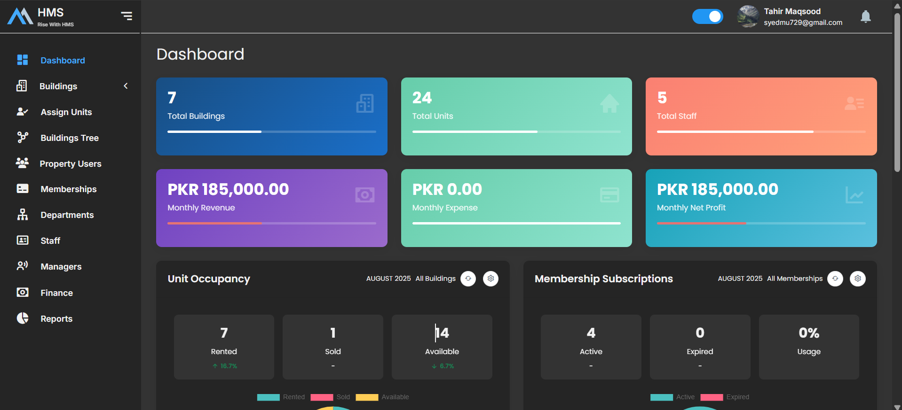
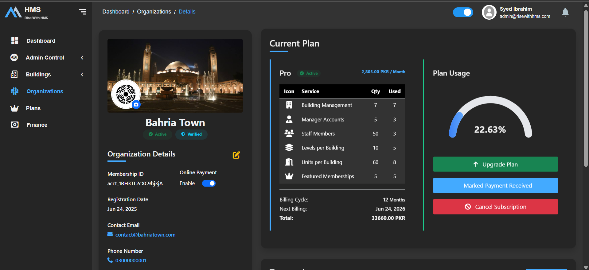
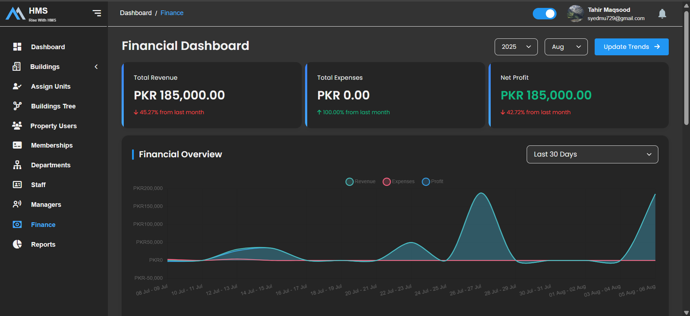

# [BuildSphere – Smart Building Management Platform](https://risewithhms.com)

**BuildSphere** is a comprehensive, subscription-based digital platform designed to **centralize and streamline residential building operations**. Tailored specifically for building owners and real estate managers, it integrates all key building services into one powerful system.

---

### Admin Dashboard  

---

### Owner Dashboard  

---

### Organization Details with Plan Usage  

---

### Finance  

---

## Key Features

### Centralized Management
- Modular system covering:
  - **Finance**
  - **Human Resources**
  - **Dashboards & Analytics**
  - **Rental Automation**
  - **Maintenance Tracking**
  - **Membership Management**

### Resident Mobile App
- View and explore **available units**
- Express **interest or purchase** units directly
- Access personalized **notifications** and **alerts**

### Exclusive Memberships
- Residents can subscribe to services such as:
  - **Gym**
  - **Clubhouse**
  - **Pool**
- Track active subscriptions and payment history

### Maintenance Requests
- Submit and monitor **maintenance issues**
- Track resolution timelines and improve service transparency

### Project Launch Support
- Give existing residents **early access** to new project launches
- Boost **unit reinvestment** and **accelerate sales cycles**

---

## Why BuildSphere?

By combining operational efficiency with **resident-centric features**, BuildSphere:
- Boosts revenue through internal sales and memberships
- Elevates the living experience with a modern digital interface
- Improves transparency, communication, and satisfaction for all stakeholders

---

## Tech Stack

- **Backend:** Laravel (PHP)
- **Frontend:** Blade templates
- **Mobile App:** Flutter & API-integrated with backend
- **Database:** MySQL
- **Authentication:** JWT-based for secure multi-role access
